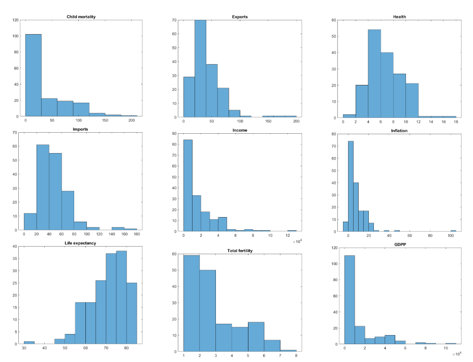
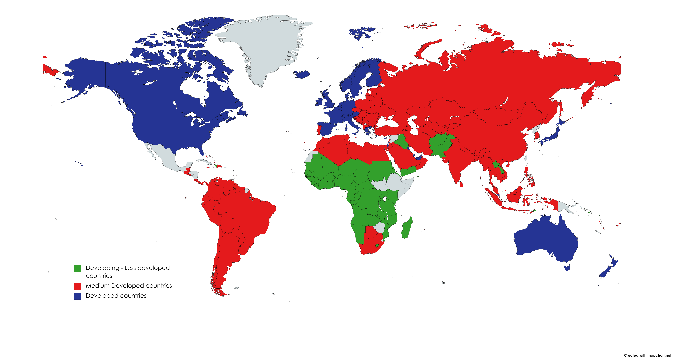

# exploring_countries_development

# Overview
This is a clustering project analyzing data from 167 countries from all around the world in order to determine their overall developement using socio-economic and health criteria. The dataset was derived from Kaggle (https://www.kaggle.com/datasets/rohan0301/unsupervised-learning-on-country-data) and consisted of consisted of 9 features and 167 data points. The whole analysis was implemented using MatLab and the algorithms explored were different initializations of K-means, K-median and K-medoids. In the end hard K-means with rand_data_init was chosen and the results of the analysis can be seen in the respective section and in the uploaded Report. 

# Dataset
The dataset was derived from Kaggle (https://www.kaggle.com/datasets/rohan0301/unsupervised-learning-on-country-data) and consisted of consisted of 9 features and 167 data points. The features' distribution can be seen in the following histogram plot. 

  

# Experiments
Different experiments occured utilizing initializations of K-means, K-median and K-medoids, as well as different feature selections, in an attempt to determine the combination of operations that offered the clearest cluster separation. The algorithm of choice for the bulk of the experiments as well as for the final clustering results was the hard k-means algorithm with rand_data_init. That was for two reasons. The first one was based on intuition, because as established in the individual experiments, k-means generated clustering results that better coincided with the true economical, social and health status of some of the countries of the dataset. The second reason was that all in all the clustering results between the two algorithms were pretty similar (with the exception of the few aforementioned countries) so k-means was deemed as the best choice because it is faster than k-medians and k-medoids.

# Results
The analysis results are explored in detail in the Report. Some of the most notable results are the large socio-economic and health differences between the countries. Considering that the countries were separated in three categories (Less, Medium, Highly Developed), it seems that most countries belong to the Medium Developed class, followed in numbers by the Less Developed and finally by the Highly Developed ones. The average value of the GDPP feature is a lot more prominent in the Highly Developed cluster compared to the other two, with the corresponding values for the other two clusters being closer. The reverse results were observed in the fertility feature, with the Less Developed cluster having more than 10 times greater values than the other two clusters, whose values for that feature are pretty close. Perhaps more important is the observation of the child mortality feature, which presents a very high mean value in the Less Developed countries, highlighting the need for support in that regard. The life expectancy is more balanced but still lower in the Less Developed countries and as expected from the GDPP, the income feature is also a whole digit lower in the Less Developed countries than it is on the others, with the Highly Developed countries having almost 4 times higher individual income than the Medium Developed countries. These results indicate a large imbalance in socio-economic and health prosperity between the less developed countries and the medium or highly developed ones. The map below depicts the class of each of the 167 countries, according to the results of this analysis.

  

